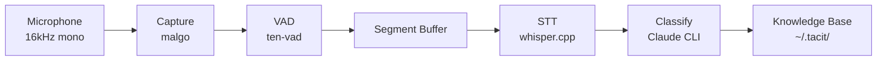
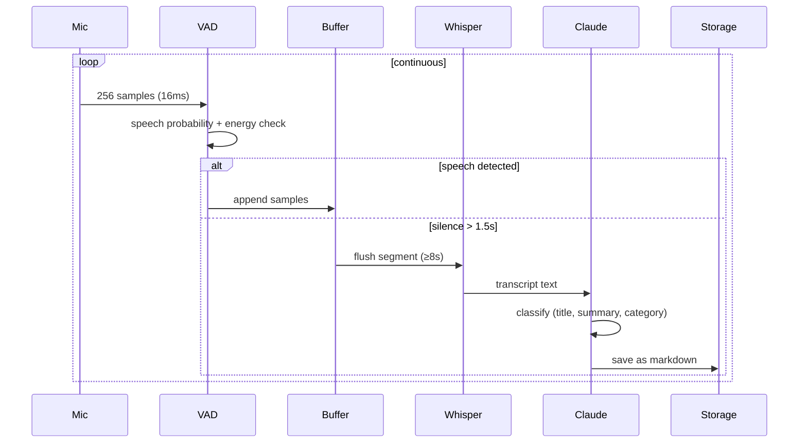
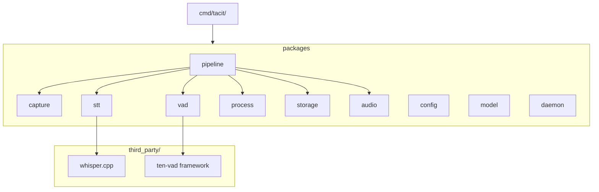

# tacit

마이크로 캡처한 음성을 실시간으로 텍스트 변환하고, AI가 분류하여 개인 지식 베이스로 저장하는 도구.

```
mic → VAD → STT → AI classify → knowledge base
```

## Architecture



### Pipeline Detail



### Project Structure



## Install

### Quick Install (prebuilt binary)

```bash
curl -fsSL https://raw.githubusercontent.com/sangmin7648/tacit/main/install.sh | sh
```

또는 버전 지정:

```bash
TACIT_VERSION=v0.1.0 curl -fsSL https://raw.githubusercontent.com/sangmin7648/tacit/main/install.sh | sh
```

### Build from Source

**요구사항:** Go 1.23+, CMake, macOS (Metal GPU 가속 지원)

```bash
git clone --recursive https://github.com/sangmin7648/tacit.git
cd tacit
make build
make install   # ~/.local/bin/tacit에 설치
```

> `~/.local/bin`이 `PATH`에 없다면 쉘 프로필에 추가:
> ```bash
> export PATH="$HOME/.local/bin:$PATH"
> ```

## Usage

### Setup (Claude Code skill 설치)

```bash
tacit setup
```

Claude Code에서 저장된 지식을 검색할 수 있는 skill을 설치한다.

### 실시간 음성 캡처

```bash
tacit listen    # 마이크 캡처 시작 (foreground)
tacit status    # 실행 상태 확인
tacit stop      # 중지
```

`start`하면 마이크 입력을 실시간으로 듣고, 음성이 감지되면 자동으로 텍스트 변환 → 분류 → 저장한다.

### 오디오 파일 처리

```bash
tacit process recording.m4a
```

기존 오디오 파일(m4a, mp3, wav, flac 등)을 지식 엔트리로 변환한다.

### Knowledge Base 구조

```
~/.tacit/
├── config.yaml              # 설정 (optional)
├── models/
│   └── ggml-base.bin        # Whisper 모델 (자동 다운로드)
├── 기술/
│   └── 20260329-153045.md
├── 아이디어/
│   └── 프로젝트/
│       └── 20260329-101530.md
└── ...
```

각 지식 엔트리는 YAML frontmatter가 포함된 마크다운 파일:

```markdown
---
title: "제목"
category: "카테고리/서브카테고리"
created_at: "2026-03-29T15:30:45+09:00"
---

AI가 생성한 요약

---

원본 STT 텍스트
```

## Configuration

`~/.tacit/config.yaml` (모든 필드 optional, 없으면 기본값 사용):

```yaml
whisper_model: base           # tiny, base, small, medium, large
min_speech_duration: 8s       # 최소 발화 길이
silence_duration: 1500ms      # 발화 종료 판정 침묵 시간
speech_threshold: 0.5         # VAD 확률 임계값 (0.0~1.0)
energy_threshold: 200         # RMS 에너지 게이트
claude_model: haiku           # 분류에 사용할 Claude 모델
```

## Requirements

- macOS (AudioToolbox, Metal GPU 가속)
- [Claude Code CLI](https://docs.anthropic.com/en/docs/claude-code) (AI 분류에 사용)
