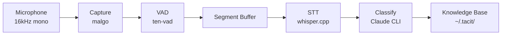

# tacit

**항상 켜있다**

말한 것들이 AI 지식이 된다. 백그라운드에서 대화를 캡처하고, AI가 꺼내 쓸 수 있도록 자동으로 정리한다.

## Install

```bash
curl -fsSL https://raw.githubusercontent.com/sangmin7648/tacit/main/install.sh | sh
```

## Setup

```bash
tacit setup
```

AI agent가 저장된 지식을 검색할 수 있는 skill을 설치한다. **한 번만 실행하면 된다.**

## 사용법

### 항상 켜두기

```bash
tacit listen    # 캡처 시작
tacit status    # 상태 확인
tacit stop      # 중지
```

켜두면 된다. 말이 감지될 때마다 자동으로 텍스트 변환 → 분류 → 저장한다.

### 기존 녹음 파일 처리

```bash
tacit process recording.m4a
```

m4a, mp3, wav, flac 등 오디오 파일을 지식 엔트리로 변환한다.

## AI에서 사용하기

`tacit setup` 이후 AI agent가 `~/.tacit/`의 지식을 바로 검색할 수 있다.

```
"저번 주 회의에서 논의한 API 설계 찾아줘"
"지난달 아이디어 중 프로젝트 관련된 것 있어?"
```

## Requirements

- macOS
- [Claude Code CLI](https://docs.anthropic.com/en/docs/claude-code)

---

<details>
<summary>소스 빌드</summary>

**요구사항:** Go 1.23+, CMake, macOS

```bash
git clone --recursive https://github.com/sangmin7648/tacit.git
cd tacit
make build
make install   # ~/.local/bin/tacit에 설치
```

> `~/.local/bin`이 `PATH`에 없다면:
> ```bash
> export PATH="$HOME/.local/bin:$PATH"
> ```

</details>

<details>
<summary>Configuration</summary>

`~/.tacit/config.yaml` (모든 필드 optional):

```yaml
whisper_model: base        # tiny, base, small, medium, large
min_speech_duration: 8s
silence_duration: 1500ms
speech_threshold: 0.5
energy_threshold: 200
claude_model: haiku
```

</details>

<details>
<summary>Architecture</summary>

```
mic → VAD → STT → AI classify → knowledge base
```



저장 포맷: YAML frontmatter가 포함된 마크다운 파일

```markdown
---
title: "제목"
category: "카테고리/서브카테고리"
created_at: "2026-03-29T15:30:45+09:00"
---

AI가 생성한 요약

---

원본 STT 텍스트
```

</details>
