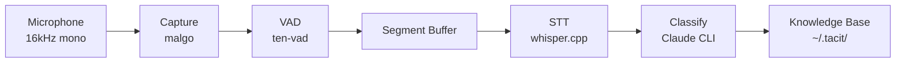

# tacit

What you say becomes AI knowledge. Captures conversations in the background, automatically organizes them so your AI can retrieve them.

## Install

```bash
curl -fsSL https://raw.githubusercontent.com/sangmin7648/tacit/main/install.sh | sh
```

## Setup

```bash
tacit setup
```

## Usage

### Keep it running

```bash
tacit listen    # start capturing
```

Leave it on. Whenever speech is detected, it automatically transcribes → classifies → stores.

## Use with AI

After `tacit setup`, you can search your spoken conversations directly from any AI agent using the SKILL:

```
/tacit.knowledge summarize the search ranking discussion from earlier
"find the API design we talked about last week"
"any project-related ideas from last month?"
```

## Requirements

- macOS
- [Claude Code CLI](https://docs.anthropic.com/en/docs/claude-code)

---

<details>
<summary>Build from source</summary>

**Requirements:** Go 1.23+, CMake, macOS

```bash
git clone --recursive https://github.com/sangmin7648/tacit.git
cd tacit
make build
make install   # installs to ~/.local/bin/tacit
```

> If `~/.local/bin` is not in your `PATH`:
> ```bash
> export PATH="$HOME/.local/bin:$PATH"
> ```

</details>

<details>
<summary>Configuration</summary>

`~/.tacit/config.yaml` (all fields optional):

```yaml
whisper_model: base        # tiny, base, small, medium, large
min_speech_duration: 8s
silence_duration: 1500ms
speech_threshold: 0.5
energy_threshold: 200
claude_model: haiku
```

</details>

<details>
<summary>Architecture</summary>

```
mic → VAD → STT → AI classify → knowledge base
```



Storage format: Markdown files with YAML frontmatter

```markdown
---
title: "Title"
category: "category"
created_at: "2026-03-29T15:30:45+09:00"
---

AI-generated summary

---

Raw STT transcript
```

</details>
