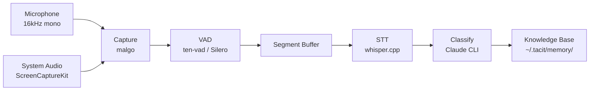

# tacit

> Harness your tacit knowledge into AI agent context — on-device, always-on transcription.

[](https://github.com/sangmin7648/tacit/releases)
[](https://go.dev/)
[](LICENSE)
[](https://github.com/sangmin7648/tacit/releases/latest)

```bash
curl -fsSL https://raw.githubusercontent.com/sangmin7648/tacit/main/install.sh | sh
tacit setup
tacit listen   # start capturing
```

---

Spoken ideas disappear. tacit transcribes them on-device, classifies them with Claude, and surfaces them as live context in any AI conversation — automatically.

<!-- TODO: Add demo GIF showing tacit listen → speech → /tacit.knowledge retrieval -->

---

## How it works

```
speak → capture → VAD → STT → classify → store → retrieve
```

1. **Capture** — Records microphone and system audio simultaneously in real time
2. **Process** — Voice Activity Detection filters silence; Whisper transcribes speech on-device
3. **Classify** — Claude extracts title, category, keywords, and summary from the transcript
4. **Store** — Saves a structured Markdown entry to `~/.tacit/memory/<category>/`
5. **Retrieve** — `/tacit.knowledge` searches your knowledge base from inside any Claude conversation

---

## Features

- **Fully automatic** — speak naturally; tacit handles transcription, classification, and storage without any manual steps
- **On-device STT** — powered by [whisper.cpp](https://github.com/ggerganov/whisper.cpp); no audio ever leaves your machine
- **Dual audio sources** — captures microphone and system audio simultaneously
- **Language-agnostic** — Whisper auto-detects language; works with Korean, English, or mixed conversation
- **AI-native retrieval** — first-class [Claude Code CLI](https://docs.anthropic.com/en/docs/claude-code) skill integration for in-conversation search

---

## Use with AI

After `tacit setup`, two skills are available inside Claude Code conversations:

### `/tacit.knowledge` — search your spoken history

```
/tacit.knowledge summarize the search ranking discussion from earlier
/tacit.knowledge find the API design we talked about last week
/tacit.knowledge any ideas about the onboarding flow from last month?
```

### `/tacit.memorize` — save the current conversation

```
/tacit.memorize
/tacit.memorize skill development   # optional hint guides categorization
```

Analyzes the current Claude conversation thread and saves it as a structured knowledge entry — automatically available to future `/tacit.knowledge` queries.

---

## Configuration

`~/.tacit/config.yaml` — all fields are optional.

| Field | Type | Default | Description |
|---|---|---|---|
| `whisper_model` | string | `base` | Whisper model size: `tiny`, `base`, `small`, `medium`, `large`. Larger = more accurate, slower. |
| `min_speech_duration` | duration | `8s` | Minimum segment length to process. Shorter segments are skipped. |
| `silence_duration` | duration | `1500ms` | Duration of silence required to end a speech segment. |
| `speech_threshold` | float | `0.5` | VAD confidence threshold (0–1). Higher = more conservative. |
| `energy_threshold` | int | `200` | Audio energy gate. Frames below this value are rejected before VAD. |
| `claude_model` | string | `haiku` | Claude model used for classification: `haiku`, `sonnet`, `opus`. |

---

## Architecture



**Storage format** — each entry is a plain Markdown file:

```markdown
---
title: "Search ranking discussion"
category: "dev"
created_at: "2026-04-14T15:30:45+09:00"
keywords: ["search", "ranking", "BM25", "lexical", "recall"]
---

One-sentence AI-generated summary.

---

Raw transcribed text from speech.
```

Entries are stored under `~/.tacit/memory/<category>/YYYYMMDD-HHMMSS.md` — plain files, no proprietary database, fully editable.

---

## Requirements

- macOS (Apple Silicon)
- [Claude Code CLI](https://docs.anthropic.com/en/docs/claude-code)

---

<details>
<summary>Build from source</summary>

**Requirements:** Go 1.23+, CMake, macOS

```bash
git clone --recursive https://github.com/sangmin7648/tacit.git
cd tacit
make build
make install   # installs to ~/.local/bin/tacit
```

> If `~/.local/bin` is not in your `PATH`:
> ```bash
> export PATH="$HOME/.local/bin:$PATH"
> ```

Run the end-to-end test to verify the full pipeline:

```bash
make e2e-test
```

</details>

<details>
<summary>Contributing</summary>

Issues and pull requests are welcome. Please open an issue first for significant changes.

```bash
make test       # run unit tests
make e2e-test   # build + process test audio through full pipeline
```

> **Note:** Do not run `go build ./...` directly — `pkg/stt` uses CGo against whisper.cpp and requires `make build` to compile first.

</details>
